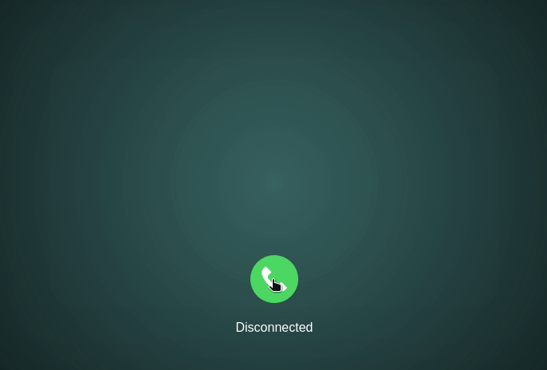
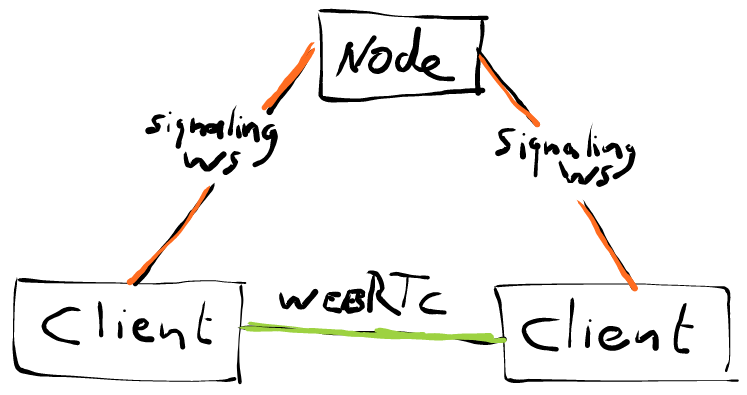

# Moshi Moshi

Talk with strangers around the world in real-time.



## Getting Started

These instructions will get you a copy of the project up and running on your local machine for development and testing purposes.

### Installing

Clone Git repository

```
git clone https://github.com/nickyvanurk/moshi-moshi.git
```

Install required npm modules

```
npm install
```

Start the client and server

```
npm run start:client
npm run start:server
```

Surf to [localhost:8080](http://localhost:8080)!

## How it Works

When a client is ready to match someone it will open a WebSocket connection to the Node back-end. After it finds a match to partner with it will exchange the required WebRTC data with this partner through the now two open WebSocket connections. Once the required WebRTC data is exchanged the peer to peer WebRTC connection will be established and the two clients will be able to talk to each other. The following diagram depicts this architecture.



## Built With

* [WebRTC](https://webrtc.org/) - Real-time communication for the web
* [Node](https://nodejs.org/en/about/) A JavaScript runtime
* [ws](https://github.com/websockets/ws) - Node WebSocket implementation

## License

This project is licensed under the [MIT License](./LICENSE.md).
